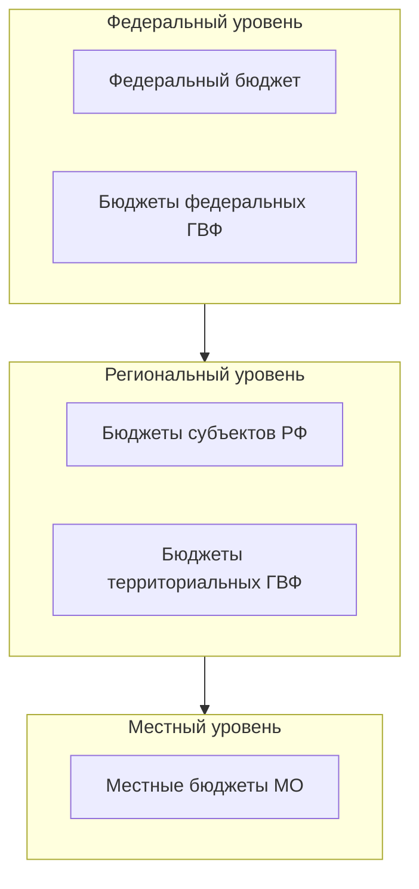

# Структура бюджетной системы РФ

**Структура [бюджетной системы Российской Федерации](/glossary/budget-system)** — не только «три уровня власти», а **состав публичных бюджетов** и принципы их устройства по Бюджетному кодексу РФ: что входит в федеральный, региональный и местный контур, где лежат **[бюджеты государственных внебюджетных фондов](./extrabudgetary-funds.md)**, и как это читается в открытых данных (тип бюджета, территория, правовой акт утверждения). Нормативно базовые нормы — **гл. 5** БК РФ (принципы), **ст. 6** (понятие и принципы), **ст. 10** (состав по уровням).

## Схема уровней (ст. 10 БК РФ)

Условная «лестница» **уровней по ст. 10 БК РФ** (не схема межбюджетных потоков и не казначейская иерархия). Узлы — **отдельные бюджеты** в составе единой бюджетной системы. Подробнее о ГВФ — на странице [государственные внебюджетные фонды](./extrabudgetary-funds.md) и в глоссарии [уровни бюджета](/glossary/budget-levels).

## Ключевые элементы

**Состав по уровням (ст. 10 БК РФ)**

- **Федеральный уровень** — [федеральный бюджет](./federal-budget.md) и бюджеты **федеральных** государственных внебюджетных фондов (на практике — прежде всего контуры [СФР](/organizations/sfr), [ФФОМС](/organizations/ffoms)).
- **Региональный уровень** — [бюджеты субъектов РФ](./regional-budgets.md) и бюджеты **территориальных** государственных внебюджетных фондов (типовой пример — **ТФОМС** в модели ОМС).
- **Местный уровень** — [местные бюджеты](./municipal-budgets.md) муниципальных образований.

**Принципы бюджетной системы (ст. 6 БК РФ)** — ориентиры для законодательства и практики составления отчётности, а не «поля в CSV»:

- единство бюджетной системы;
- сбалансированность бюджетов;
- эффективность использования бюджетных средств;
- прозрачность (открытость) и полнота отражения доходов, расходов и источников финансирования дефицита бюджетов.

**Связь с циклом и классификациями** — у каждого бюджета в составе системы свой **[бюджетный процесс](/glossary/budget-process)** и своя роспись; агрегаты вроде **[консолидированного бюджета субъекта](/glossary/consolidated-budget)** не отменяют трёхуровневую схему ст. 10, а задают **сводную** отчётность по методике.

## Где найти данные

**Единая витрина планов и законов по разным бюджетам**

- [ГИИС «Электронный бюджет»](/information-systems/federal/giis-eb) — `budget.gov.ru`: проекты и законы о бюджетах **разных** звеньев системы; при выгрузке явно фильтруйте **тип бюджета** и год.
- [Наборы данных портала budget.gov.ru](/data-sources/federal/budget-gov-ru-datasets) — машиночитаемые паспорта и таблицы; сверяйте план, уточнения и факт по паспорту набора.

**Своды и исполнение по уровням**

- [Отчёты об исполнении бюджетов (обзор)](/data-sources/federal/otchety-ob-ispolnenii-byudzhetov) — лестница входов к факту исполнения по бюджетам бюджетной системы.
- [Региональные бюджеты](/data-sources/federal/regionalnye-byudzhety) и [консолидированные бюджеты субъектов](/data-sources/regional/consolidated-budgets) — региональный контур и сводная отчётность субъекта.
- [Муниципальные бюджеты](/data-sources/federal/municipalnye-byudzhety) и [муниципальные бюджеты (региональный материал)](/data-sources/regional/municipal-budgets) — местный уровень; полнота публикаций неоднородна.
- [Открытые данные Минфина России](/data-sources/federal/minfin-opendata) — справочные и тематические ряды; проверяйте, к какому **бюджету** и периоду относится показатель.

**Дополнительно**

- [Портал Федерального казначейства](/information-systems/federal/roskazna-portal) — публичные разделы об исполнении и открытые данные оператора.

## Связанные термины

- [Бюджетная система РФ](/glossary/budget-system) — определение по ст. 6 БК РФ и рамка для интерпретации сводов.
- [Уровни бюджета](/glossary/budget-levels) — расклад ст. 10: что относится к федеральному, региональному и местному контуру, включая ГВФ.
- [Государственные внебюджетные фонды](/glossary/extrabudgetary-funds) — самостоятельные бюджеты фондов в составе системы, не подмножество «федерального бюджета» в узком смысле.
- [Бюджетный процесс](/glossary/budget-process) — составление, утверждение, исполнение и отчётность по каждому бюджету.
- [Межбюджетные трансферты](/glossary/transfers) — связь между бюджетами **разных** частей системы; важны для понимания двойного счёта при агрегировании.

Полный список терминов — в [глоссарии](/glossary/).

## См. также в разделе «Бюджетная система»

- [Федеральный бюджет](./federal-budget.md), [бюджеты субъектов](./regional-budgets.md), [местные бюджеты](./municipal-budgets.md)
- [Государственные внебюджетные фонды](./extrabudgetary-funds.md)
- [Бюджетный цикл](./budget-cycle.md)
