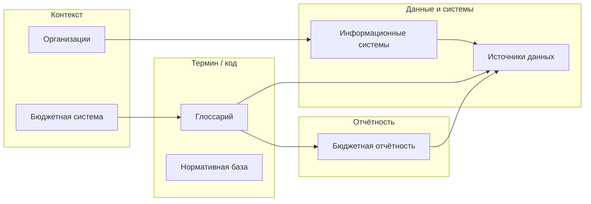

# Карта данных и типовые маршруты

Эта страница — «надстройка» над разделами книги: куда идти, если нужно **определение**, **систему**, **файл с данными**, **форму** или **пример кода**. Подробнее о разделах — в [Как пользоваться базой знаний](./how-to-use.md). Если вы здесь впервые — начните с [Быстрого старта](./getting-started.md).

## Схема маршрутов (обзор)

## Маршрут 0. Новый читатель

1. [Быстрый старт](./getting-started.md) — порядок знакомства с книгой.
2. [Руководство по RAG](./rag-guide.md) — для разработчиков индексации и ассистентов.

## Маршрут 1. Не понимаю термин или код

1. [Глоссарий](/glossary/) — карточка термина (например [КБК](/glossary/kbk), [КОСГУ](/glossary/kosgu)).
2. Привязка к данным — блок «Где встречается в учёте и данных» в карточке и ссылки на [источники](/data-sources/) и [отчётность](/reporting/).
3. Нормативка — [Нормативная база](/legal/), чаще всего [Бюджетный кодекс](/legal/budget-code) и приказы по классификации ([приказы Минфина по КБК и КОСГУ](/legal/budget-classification-orders)).

## Маршрут 2. Нужен конкретный портал или выгрузка

1. [Информационные системы](/information-systems/) — кто оператор, витрина, границы контура (например [ГИИС «Электронный бюджет»](/information-systems/federal/giis-eb), [ЕИС](/information-systems/federal/zakupki)).
2. [Источники данных](/data-sources/) — открытые наборы и API (например [Наборы budget.gov.ru](/data-sources/federal/budget-gov-ru-datasets), [открытые данные Минфина](/data-sources/federal/minfin-opendata)).
3. [How-to: автоматизация](/howto/automation/) — примеры запросов и скриптов.

## Маршрут 3. Нужна форма отчётности или методика показателя

1. [Бюджетная отчётность](/reporting/) — карточка формы (например [0503117](/reporting/0503117)).
2. [Источники данных](/data-sources/) — где публикуются выгрузки (например [отчёты и материалы Казначейства](/data-sources/federal/roskazna-reports)).
3. [Глоссарий](/glossary/) — термины исполнения и учёта (например [казначейское исполнение](/glossary/treasury-execution)).

## Маршрут 4. Кто владелец данных и как устроен бюджет «в целом»

1. [Организации](/organizations/) — ведомство и его роль (например [Минфин](/organizations/minfin), [Федеральное казначейство](/organizations/federal-treasury)).
2. [Бюджетная система](/budget-system/) — уровни бюджетов, цикл, доходы и расходы.
3. [Справочники](/reference/) — коды территорий, ОКПД2 в закупках, идентификаторы в открытых данных.

## Для ИИ-ассистентов и редакторов

- Правила оформления карточек и перекрёстных ссылок — в файле **[AGENTS.md](https://github.com/infoculture/opengovfinancesbook/blob/master/AGENTS.md)** в корне репозитория (для Cursor и других средств — основной контракт качества).
- Принципы структуры страниц под поиск и RAG — в [Как пользоваться базой знаний](./how-to-use.md).
- Словарь вторых тегов `tags` в frontmatter — на странице [Таксономия тегов](/reference/tags-taxonomy).
