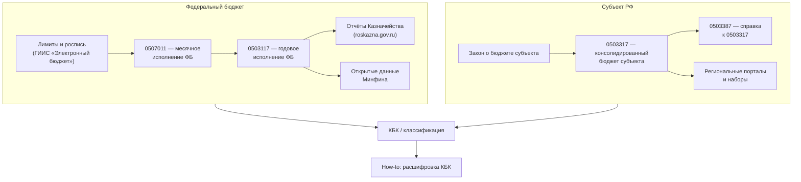

# Как устроена бюджетная отчётность

Эта страница — **каноническая точка входа** в логику раздела [«Отчётность и формы»](/reporting/): какие семейства форм закрывают исполнение бюджета, консолидацию, учреждения, долг и смежные задачи, и **куда перейти дальше** без перебора всех карточек. Детали по каждой форме — в соответствующих карточках; здесь — карта и связи.

## Коротко

- **Федеральное исполнение по КБК** — годовые и месячные отчёты Казначейства и открытые наборы Минфина; старт с [формы 0503117](/reporting/0503117), [0507011](/reporting/0507011) и [отчётов Казначейства](/reporting/treasury-reports).
- **Консолидированный бюджет субъекта** — [0503317](/reporting/0503317), справочно [0503387](/reporting/0503387); машиночитаемые следы часто на региональных порталах (см. [региональные источники](/data-sources/regional/)).
- **Учреждения и получатели средств** — [ПФХД](/reporting/pfhd), [сметы](/reporting/budget-estimates), [бухотчётность учреждений](/reporting/institution-financial-statements), [субсидии и гранты](/reporting/subsidy-recipient-reporting).
- **Долг, резервы, внебюджетные фонды** — отдельные карточки в разделе; не смешивайте с операционным исполнением по КБК без методики консолидации.

## Диаграмма связей основных форм исполнения

Ниже — упрощённый **поток данных** от плана к публичным выгрузкам для федерального и регионального контуров. Номера форм — ориентиры; фактический состав отчётности задаёт нормативка в карточках.

## Задача аналитика → форма → источник → how-to

Каждая строка — **готовый маршрут** по опубликованным страницам wiki.

| Аналитическая задача | Форма или группа форм | Источник данных / ИС | How-to / методика |
| --- | --- | --- | --- |
| Исполнение **федерального** бюджета по КБК и сопоставление с открытыми рядами | [0503117](/reporting/0503117), [0507011](/reporting/0507011), [отчёты Казначейства](/reporting/treasury-reports) | [Открытые данные Минфина](/data-sources/federal/minfin-opendata), [отчёты об исполнении бюджетов](/data-sources/federal/otchety-ob-ispolnenii-byudzhetov), [Казначейство](/data-sources/federal/roskazna-reports) | [Расшифровка КБК](/howto/analysis/kbc-decoding), [pandas: КБК](/howto/automation/pandas-kbc) |
| **Консолидированный** бюджет субъекта и межбюджетные потоки в отчётности | [0503317](/reporting/0503317), [0503387](/reporting/0503387) | [Консолидированные бюджеты](/data-sources/regional/consolidated-budgets), [краткая информация Минфина по субъектам](/data-sources/federal/minfin-subbud-execute), [региональные порталы](/data-sources/regional/regional-portals) | [Региональный бюджет: анализ](/howto/analysis/regional-budget-analysis), [региональные порталы](/howto/access/regional-portals) |
| Связка с **электронной** отчётностью и порталами планирования | Семейство форм в карточках [ГИИС «Электронный бюджет»](/information-systems/federal/giis-eb) | [Наборы «Электронного бюджета»](/data-sources/federal/budget-gov-ru-datasets) | [API портала «Электронный бюджет»](/howto/access/budget-gov-api) |
| **Закупки** как трассировка расходов по КБК | [Отчётность по контрактам](/reporting/procurement-contract-reporting) | [Данные по закупкам](/data-sources/federal/procurement), [ЕИС](/information-systems/federal/zakupki) | [Анализ закупок](/howto/analysis/procurement-analysis) |
| **Госкорпорации** и корпоративное раскрытие (не подмена бюджетных форм) | [Обзор сектора](/reporting/state-sector-overview) | [e-disclosure](/data-sources/federal/e-disclosure-ru) и связанные карточки из обзора | См. ссылки в [навигаторе](/reporting/state-sector-overview) |

## Где читать коды и не путать год редакции

- [Обзор бюджетной классификации](/budget-classification/overview) и [приказы Минфина по классификации](/legal/budget-classification-orders).
- [Разобранные примеры КБК](/budget-classification/kbk-worked-examples) и [хронология изменений классификации](/budget-classification/classification-changes-by-year) (пополняется по мере появления CSV в `wiki/budget-classification/assets/`).

## История редакций форм

В каждой карточке формы в [оглавлении отчётности](/reporting/) по мере обновления SHOULD появляться явное описание **годов применимости** и ссылка на нормативку; новые карточки MUST приводиться к [шаблону карточки отчётности](/reporting/reporting-card-template) (см. `AGENTS.md`).

## См. также

- [Оглавление раздела «Отчётность»](/reporting) — полный список карточек.
- [Карта данных](/intro/data-map) — сценарный вход без номера формы.
